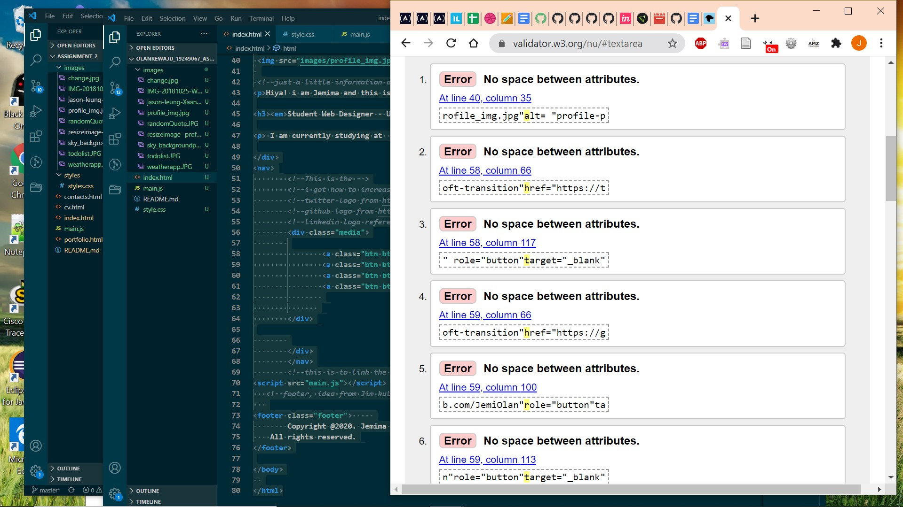

# Olanrewaju_19249067_AS2_part1

part of the html errors

the other half of the html problem

this shows the fixing process done by deleting excess div and spaces and slashes

this shows the fixing process done by deleting excess div and spaces and slashes

this shows all the error have been fixed

this shows the current error and warning

fixed the webkit-sticky footer

i left the error because i wanted 100 as its shows absoluty to the webpage and avoiding unnecessary margin problems
